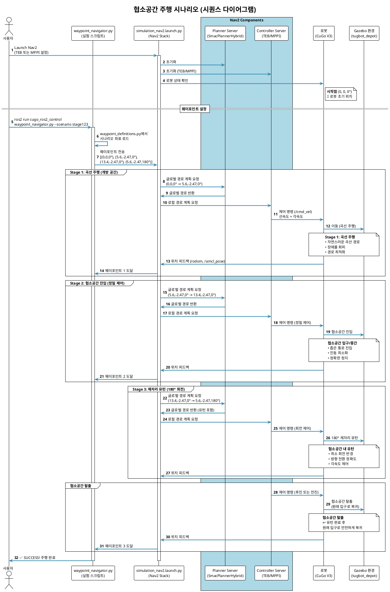

# TEB vs MPPI 비교 실험

이 폴더는 TEB Local Planner와 MPPI Controller의 성능을 비교 평가하기 위한 도구들을 포함합니다.

## 📂 폴더 구조

```
evaluation/
├── 📄 README.md                          # 이 파일 (전체 가이드)
├── 📄 QUICK_REFERENCE.md                 # 빠른 참조 가이드
├── 📄 PARAMETER_BASELINE.md              # 파라미터 동등성 증명
├── 📄 COMPARISON_TABLE.md                # TEB vs MPPI 상세 비교표
├── 📄 RVIZ_VISUALIZATION_GUIDE.md        # RViz 시각화 가이드
│
├── 📂 configs/                           # 플래너 설정 파일
│   ├── cugo_v3_teb.yaml                 # TEB 설정
│   └── cugo_v3_mppi.yaml                # MPPI 설정
│
├── 📂 scenarios/                         # 실험 시나리오
│   ├── waypoint_definitions.py          # 웨이포인트 좌표 정의
│   └── waypoint_navigator.py            # 웨이포인트 주행 + rosbag 자동 기록
│
├── 📂 analysis/                          # 데이터 분석
│   ├── teb_vs_mppi_analysis.ipynb       # 메인 분석 노트북 (ALL-IN-ONE)
│   ├── verify_parameters.py             # 파라미터 검증 스크립트
│   ├── bag_to_csv.py                    # Rosbag → CSV 변환 도구
│   └── README.md                         # 분석 가이드
│
└── 📂 rosbags/                           # Rosbag 저장소
    ├── teb/                              # TEB 실험 데이터
    │   ├── stage123_<timestamp>/        # 자동 생성 (타임스탬프 포함)
    │   │   ├── *.db3                    # rosbag 파일
    │   │   ├── metadata.yaml
    │   │   └── csv/                     # CSV 변환 결과
    │   │       └── combined.csv
    │   └── ...
    └── mppi/                             # MPPI 실험 데이터
        ├── stage123_<timestamp>/
        └── ...
```

## 📚 문서 가이드

- **README.md** (이 파일): 실험 진행 순서 및 전체 개요
- **PARAMETER_BASELINE.md**: 파라미터 동등성 수식적 증명
- **COMPARISON_TABLE.md**: TEB vs MPPI 상세 비교표
- **QUICK_REFERENCE.md**: 한 페이지 빠른 참조
- **RVIZ_VISUALIZATION_GUIDE.md**: RViz 시각화 설정

## 🚀 실험 진행 순서

### Phase 1: 실험 환경 준비

#### 1.1 파라미터 검증
실험 전에 TEB와 MPPI 설정이 올바른지 확인:

```bash
cd ~/dev_ws/cugo_ws/src/rtc-teb_local_planner/cugo_ros_simulations/evaluation/analysis
python3 verify_parameters.py
```

#### 1.2 데이터 저장 폴더 확인
```bash
ls -la ~/dev_ws/cugo_ws/src/rtc-teb_local_planner/cugo_ros_simulations/evaluation/rosbags/
# teb/, mppi/ 폴더가 있어야 함 (없으면 자동 생성됨)
```

**참고:** `waypoint_navigator.py`의 `--record-bag` 옵션을 사용하면 rosbag이 자동으로 기록되며, 폴더가 없을 경우 자동 생성됩니다.

---

### Phase 2: TEB 실험

#### 2.1 Gazebo 시뮬레이션 시작

**Terminal 1**: Gazebo 월드 실행
```bash
ros2 launch cugo_ros2_control sim_world.launch.py world:=tugbot_depot
```
- Gazebo가 완전히 로드될 때까지 대기 (30초~1분)

**Terminal 2**: 포인트클라우드 변환
```bash
ros2 launch cugo_ros2_control pointcloud_to_scan.launch.py
```
- `/scan` 토픽 발행 확인

#### 2.2 TEB 네비게이션 시작

**Terminal 3**: TEB 설정으로 Nav2 실행
```bash
ros2 launch cugo_ros2_control simulation_nav2.launch.py \
  params_file:=$(ros2 pkg prefix cugo_ros2_control)/share/cugo_ros2_control/evaluation/configs/cugo_v3_teb.yaml
```
- RViz2가 열리고 Nav2가 활성화될 때까지 대기 (1~2분)
- RViz2에서 "2D Pose Estimate" 클릭하여 로봇 초기 위치 설정 (0, 0, 0)

#### 2.3 웨이포인트 네비게이션 실행 (rosbag 자동 기록)

**Terminal 4**: TEB 실험 실행 (rosbag 자동 기록 포함)
```bash
ros2 run cugo_ros2_control waypoint_navigator.py \
  --scenario stage123 \
  --record-bag \
  --planner teb
```

**실행 내용:**
- 웨이포인트 네비게이션 시작
- rosbag 자동 기록 시작 (다음 토픽들 포함):
  - `/imu/data_raw`, `/odom`, `/cmd_vel`
  - `/local_plan`, `/global_plan`, `/amcl_pose`
  - `/tf`, `/tf_static`
- 로봇이 웨이포인트를 따라 주행
- RViz2에서 파란색 TEB 마커들 확인
- 네비게이션 완료 시 rosbag 자동 종료

**저장 위치:**
- `evaluation/rosbags/teb/stage123_<timestamp>/`
- 예: `stage123_20250102_143025/`

**관찰 사항:**
- 로봇 주행 경로의 부드러움
- 장애물 회피 동작
- 목표 지점 도달 정확도

#### 2.4 실험 반복 (통계적 신뢰도)

동일한 과정을 2회 더 반복 (총 3회):
```bash
# Trial 1 (위에서 이미 실행)
ros2 run cugo_ros2_control waypoint_navigator.py --scenario stage123 --record-bag --planner teb

# Trial 2
ros2 run cugo_ros2_control waypoint_navigator.py --scenario stage123 --record-bag --planner teb

# Trial 3
ros2 run cugo_ros2_control waypoint_navigator.py --scenario stage123 --record-bag --planner teb
```

**참고:**
- 각 실험마다 타임스탬프가 자동으로 붙어 파일 이름 충돌 없음
- 필요시 Gazebo 재시작하여 환경 초기화
- 각 trial의 rosbag은 자동으로 별도 폴더에 저장됨

---

### Phase 3: MPPI 실험

#### 3.1 Nav2 재시작 (TEB → MPPI 전환)
**Terminal 3**에서 `Ctrl+C`로 Nav2 중지 → 5초 대기

#### 3.2 MPPI 네비게이션 시작

**Terminal 3**: MPPI 설정으로 Nav2 재실행
```bash
ros2 launch cugo_ros2_control simulation_nav2.launch.py \
  params_file:=$(ros2 pkg prefix cugo_ros2_control)/share/cugo_ros2_control/evaluation/configs/cugo_v3_mppi.yaml
```
- RViz2에서 다시 "2D Pose Estimate" 설정 (동일한 위치: 0, 0, 0)

#### 3.3 MPPI 실험 실행 (rosbag 자동 기록)

**Terminal 4**: MPPI 실험 실행 (rosbag 자동 기록 포함)
```bash
ros2 run cugo_ros2_control waypoint_navigator.py \
  --scenario stage123 \
  --record-bag \
  --planner mppi
```

**실행 내용:**
- 웨이포인트 네비게이션 시작
- rosbag 자동 기록 (TEB와 동일한 토픽 세트)
- 로봇 주행 관찰 (TEB와 다른 패턴 확인)
- 네비게이션 완료 시 rosbag 자동 종료

**저장 위치:**
- `evaluation/rosbags/mppi/stage123_<timestamp>/`

**3회 반복:**
```bash
# Trial 1
ros2 run cugo_ros2_control waypoint_navigator.py --scenario stage123 --record-bag --planner mppi

# Trial 2
ros2 run cugo_ros2_control waypoint_navigator.py --scenario stage123 --record-bag --planner mppi

# Trial 3
ros2 run cugo_ros2_control waypoint_navigator.py --scenario stage123 --record-bag --planner mppi
```

---

### Phase 4: 데이터 분석

#### 4.1 Rosbag 파일 확인
```bash
# TEB 데이터 확인 (타임스탬프는 실제 생성된 폴더명으로 대체)
ros2 bag info ~/dev_ws/cugo_ws/src/rtc-teb_local_planner/cugo_ros_simulations/evaluation/rosbags/teb/stage123_20250102_143025

# MPPI 데이터 확인
ros2 bag info ~/dev_ws/cugo_ws/src/rtc-teb_local_planner/cugo_ros_simulations/evaluation/rosbags/mppi/stage123_20250102_150130
```
- 각 bag에 필요한 토픽이 모두 있는지 확인 (특히 `/imu/data_raw`)

#### 4.2 Rosbag → CSV 변환

```bash
cd ~/dev_ws/cugo_ws/src/rtc-teb_local_planner/cugo_ros_simulations/evaluation/analysis

# TEB 데이터 변환
python3 bag_to_csv.py \
  --bag-path ~/dev_ws/cugo_ws/src/rtc-teb_local_planner/cugo_ros_simulations/evaluation/rosbags/teb/stage123_20250102_143025 \
  --output-dir ~/dev_ws/cugo_ws/src/rtc-teb_local_planner/cugo_ros_simulations/evaluation/rosbags/teb/stage123_20250102_143025/csv \
  --combined

# MPPI 데이터 변환
python3 bag_to_csv.py \
  --bag-path ~/dev_ws/cugo_ws/src/rtc-teb_local_planner/cugo_ros_simulations/evaluation/rosbags/mppi/stage123_20250102_150130 \
  --output-dir ~/dev_ws/cugo_ws/src/rtc-teb_local_planner/cugo_ros_simulations/evaluation/rosbags/mppi/stage123_20250102_150130/csv \
  --combined
```

**결과:**
- `combined.csv` 파일 생성 (모든 토픽이 하나의 CSV로 통합)
- 이후 pandas로 0.1초 단위 다운샘플 등 전처리 수행

#### 4.3 Jupyter Notebook 분석

```bash
cd ~/dev_ws/cugo_ws/src/rtc-teb_local_planner/cugo_ros_simulations/evaluation/analysis
jupyter lab teb_vs_mppi_analysis.ipynb
```

**노트북에서 수행할 작업:**
1. Rosbag 데이터 로드 및 전처리
2. 파생 변수 계산 (저크, 각가속도, 주행 거리)
3. 탐색적 데이터 분석 (EDA)
4. 메트릭 계산 (안정성, 효율성, 정밀도)
5. 통계 검정 (t-test, Cohen's d)
6. 시각화 (시계열, Box plot, Radar chart, 궤적)
7. 결론 및 권장사항

---

## 📊 평가 메트릭

### 1. 안정성 및 승차감
- **각속도 변화량 (angular_vel_std)**: 낮을수록 부드러운 주행
- **저크 (jerk)**: 가속도 변화율 (낮을수록 좋음)
- **급가속/급제동 횟수**: 묘목 손상 위험 지표

### 2. 주행 효율성
- **주행 시간 (total_time)**: 목표 지점까지 걸린 시간
- **주행 거리 (total_distance)**: 실제 이동 거리
- **평균 속도**: 효율성 지표

### 3. 제어 정밀도
- **경로 추종 오차**: Global Path에서 벗어난 정도
- **도착 위치 오차**: 목표 지점 도달 정확도

### 4. 연산 비용
- **제어 주파수 (cmd_vel_frequency)**: 명령 발행 주파수
- **CPU 사용률**: 연산 부하

---

## 🎯 시나리오 설명

### stage123 (3-Stage 평지 주행 실험)

평지 환경에서 다양한 주행 상황을 테스트하는 3단계 시나리오입니다.

#### Stage 1: 일반 곡선 주행 (접근)
- **목적**: 기본 주행 성능 및 곡선 추종 능력 평가
- **특징**: 
  - 개방된 공간에서 목표 지점까지 자연스러운 곡선 주행
  - 장애물 회피 및 경로 최적화 능력 확인
- **경로**: (0, 0, 0°) → (5.6, -2.47, 0°)
- **평가 지표**: 
  - 경로 부드러움 (각속도 변화)
  - 주행 효율성 (시간, 거리)

#### Stage 2: 협소공간 진입 및 정지 (정밀 제어)
- **목적**: 좁은 공간에서의 정밀 제어 능력 평가
- **특징**:
  - 양옆에 장애물이 있는 좁은 통로 진입
  - 협소공간 중간 지점에서 정확한 정지
  - 장애물 충돌 방지를 위한 안정적인 주행 필수
- **경로**: (5.6, -2.47, 0°) → (13.4, -2.47, 0°) [협소공간 중간에서 정지]
- **평가 지표**:
  - 진동 최소화 (저크, 각속도 표준편차)
  - 경로 이탈 최소화 (장애물 충돌 방지)
  - 정지 정확도

#### Stage 3: 제자리 유턴 및 탈출 (고난도 기동)
- **목적**: 제한된 공간에서의 회전 기동 능력 평가
- **특징**:
  - 협소공간 내에서 180° 제자리 유턴 (U-turn)
  - 원래 진입했던 입구로 후진 없이 빠져나오기
  - 가장 높은 제어 정밀도 요구
- **경로**: (13.4, -2.47, 0°) → (5.6, -2.47, 180°) [유턴 후 협소공간 탈출]
- **평가 지표**:
  - 회전 반경 최소화
  - 회전 중 안정성 (각속도 제어)
  - 최종 방향 정확도 (180° 도달)

#### 시나리오 전체 흐름



**시스템 구성요소 설명:**

| 구성요소 | 파일/노드 | 역할 |
|---------|----------|------|
| **사용자** | - | 실험 시작 및 모니터링 |
| **waypoint_navigator.py** | `evaluation/scenarios/waypoint_navigator.py` | 웨이포인트 전송 및 진행 상황 모니터링 |
| **simulation_nav2.launch.py** | `launch/simulation/simulation_nav2.launch.py` | Nav2 전체 스택 실행 |
| **Planner Server** | SmacPlannerHybrid | 글로벌 경로 계획 (A* 기반) |
| **Controller Server** | TEB 또는 MPPI | 로컬 경로 계획 및 제어 명령 생성 |
| **로봇 (CuGo V3)** | Gazebo 시뮬레이션 | 제어 명령 실행 및 센서 데이터 발행 |
| **Gazebo 환경** | tugbot_depot world | 시뮬레이션 환경 제공 |

**데이터 흐름:**
1. `waypoint_definitions.py` → 시나리오 좌표 정의
2. `waypoint_navigator.py` → Nav2에 웨이포인트 전송
3. Nav2 → 경로 계획 및 제어
4. `/cmd_vel` → 로봇 제어 명령
5. `/odom`, `/amcl_pose` → 로봇 위치 피드백

#### 실제 응용 시나리오

1. **Stage 1**: 개방된 공간에서 목표 지점까지 효율적인 이동
2. **Stage 2**: 좁은 통로로 진입하여 정확한 위치에 정지
3. **Stage 3**: 제한된 공간에서 방향 전환 후 안전하게 복귀

#### TEB vs MPPI 예상 차이점

| Stage | TEB 특징 | MPPI 특징 |
|-------|---------|-----------|
| **Stage 1** | 정확한 경로 추종, 약간의 진동 | 부드러운 곡선, 경로 이탈 가능 |
| **Stage 2** | 정밀한 정지, 진동 발생 가능 | 안정적 주행, 정지 위치 오차 가능 |
| **Stage 3** | 정확한 180° 회전, 각속도 변화 큼 | 부드러운 회전, 최종 방향 오차 가능 |

이 시나리오는 평지 주행 환경에서 다양한 주행 상황(곡선 주행, 협소공간 진입, 제자리 유턴)을 테스트하여, TEB와 MPPI의 실용적인 성능 차이를 명확히 비교할 수 있습니다.

---

## 💡 실험 팁

### 1. 일관성 유지
- TEB와 MPPI 실험 시 동일한 초기 위치 사용 (0, 0, 0)
- 동일한 시나리오와 웨이포인트 사용
- 각 trial마다 Gazebo 재시작하여 환경 초기화

### 2. 데이터 품질
- Rosbag 기록 시작 후 2-3초 대기 후 네비게이션 시작
- 실험 완료까지 중단하지 않기
- 각 실험마다 다른 폴더에 저장

### 3. IMU 데이터 우선
- 가속도/각속도는 `/imu/data_raw`에서 추출 (정확도 높음)
- Odom은 위치/속도 보조용으로 사용
- 시간 동기화는 IMU 기준으로 수행

### 4. 분석
- Jupyter Notebook에서 모든 분석 수행
- 각속도 시계열 그래프가 가장 중요 (교수님께 보여드리기)
- 여러 번 실험하여 평균값 사용 (최소 3회)

---

## 🔧 문제 해결

### Nav2가 시작되지 않을 때
```bash
# Lifecycle 상태 확인
ros2 lifecycle list /controller_server
ros2 lifecycle set /controller_server configure
ros2 lifecycle set /controller_server activate
```

### MPPI 플러그인을 찾을 수 없을 때
```bash
# nav2_mppi_controller 설치 확인
ros2 pkg list | grep mppi

# 없으면 설치
sudo apt install ros-humble-nav2-mppi-controller
```

### IMU 토픽이 없을 때
```bash
# 토픽 확인
ros2 topic list | grep imu

# 대체: /odom에서 속도 미분하여 가속도 계산
```

### Rosbag 분석이 안 될 때
```bash
# Rosbag 정보 확인
ros2 bag info rosbags/teb/stage123_trial1

# 토픽 리스트 확인
ros2 bag info rosbags/teb/stage123_trial1 | grep topics
```

---

## 📈 예상 결과

### TEB의 특징
- **장점**: 정밀한 경로 추종, 목표 도달 정확도 높음
- **단점**: 각속도 변화가 크고 진동이 많음 (톱니 모양)

### MPPI의 특징
- **장점**: 부드러운 주행, 승차감 우수 (각속도 변화 작음)
- **단점**: 경로 추종 정확도가 TEB보다 낮을 수 있음

### 권장사항
- **안정성 중시**: MPPI 추천 (진동 최소화, 승차감 우수)
- **정밀도 중시**: TEB 고려 (정확한 위치 제어 필요 시)

---

## 📚 참고 자료

- [Nav2 Documentation](https://navigation.ros.org/)
- [TEB Local Planner](http://wiki.ros.org/teb_local_planner)
- [MPPI Controller](https://navigation.ros.org/configuration/packages/configuring-mppic.html)
- [Jupyter Notebook Tutorial](https://jupyter.org/documentation)

---

## 📧 문의

실험 관련 문의사항이나 버그 리포트는 프로젝트 관리자에게 연락하세요.
